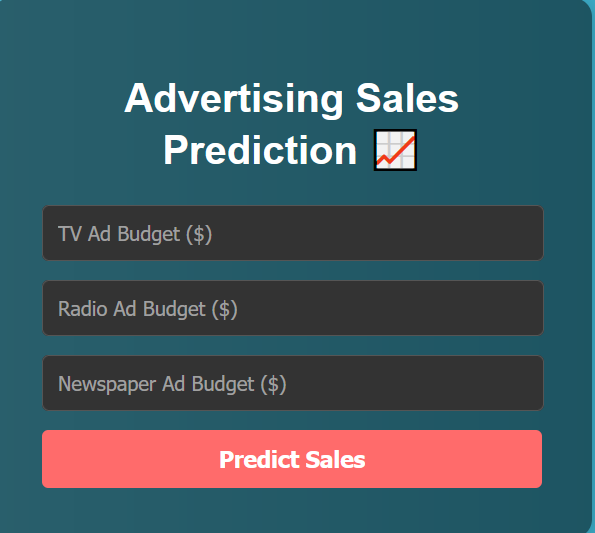

# 📈 Advertisement Sales Prediction

A machine learning project that predicts product sales based on advertising expenditure across different media channels (TV, Radio, and Newspaper). This repository contains a trained Linear Regression model deployed as a web application using the Flask framework.

---

## ✨ Live Demo

You can interact with the live application here:

**[https://advertising-sales-prediction-ntdl.onrender.com]**



---

## ✨ Features

-   **Predictive Model:** Utilizes a Linear Regression model to forecast sales.
-   **Web Interface:** An easy-to-use web form to input advertising budgets and get instant sales predictions.
-   **Data Analysis:** Includes a Jupyter notebook (`sales.ipynb`) with exploratory data analysis and model evaluation.

---

## 🛠️ Tech Stack

-   **Backend:** Python, Flask
-   **ML/Data:** Scikit-learn, Pandas, NumPy
-   **Frontend:** HTML, CSS

---

## 🚀 How to Run Locally

To get a local copy up and running, follow these simple steps.

**1. Clone the repository:**
```bash
git clone [https://github.com/ydushyant64/Advertisement-Sales-Prediction.git](https://github.com/ydushyant64/Advertisement-Sales-Prediction.git)
cd Advertisement-Sales-Prediction
