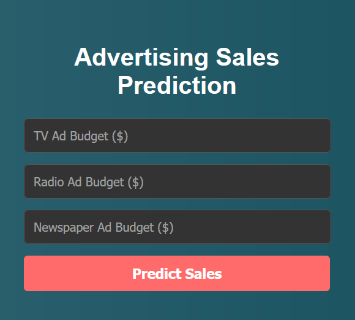

# AI-Powered Sales Predictor

Ever wonder how much you should spend on advertising? This project is an attempt to answer that question. I've built a simple but powerful web application that predicts product sales based on how much you spend on TV, Radio, and Newspaper ads.

---

## Live Demo

You can try the live application here:

**[https://huggingface.co/spaces/ydushyant64/Advertising_sales_prediction](https://huggingface.co/spaces/ydushyant64/Advertising_sales_prediction))**

---

## A Quick Look

Here’s a snapshot of the application in action. You can input your ad budgets and get an instant sales forecast!

---

## The Big Idea

The goal was to create a straightforward tool to help make marketing budget decisions. I wanted to build something that could:
-   Take advertising spending on different channels as input.
-   Use a machine learning model to predict the resulting sales.
-   Be simple and intuitive for anyone to use through a web browser.

---

## How It's Built: From Data to Dollars

1.  **The Foundation: The Dataset**
    The model was trained on a classic advertising dataset containing 200 examples of ad campaigns, linking the budget spent on TV, Radio, and Newspaper to the final sales figures.

2.  **The Brains: Linear Regression**
    I used a **Linear Regression** model, a reliable and easy-to-understand machine learning algorithm. It learns the relationship between each advertising channel and sales, figuring out which channels give the biggest bang for your buck.

3.  **The Interface: Flask Web App**
    To make the model usable, I wrapped it in a web application built with **Flask**. The interface is a simple form styled with HTML and CSS, making it easy to input your numbers and see the prediction.

---

## Libraries Used

-   Flask
-   Scikit-learn
-   Pandas
-   NumPy
